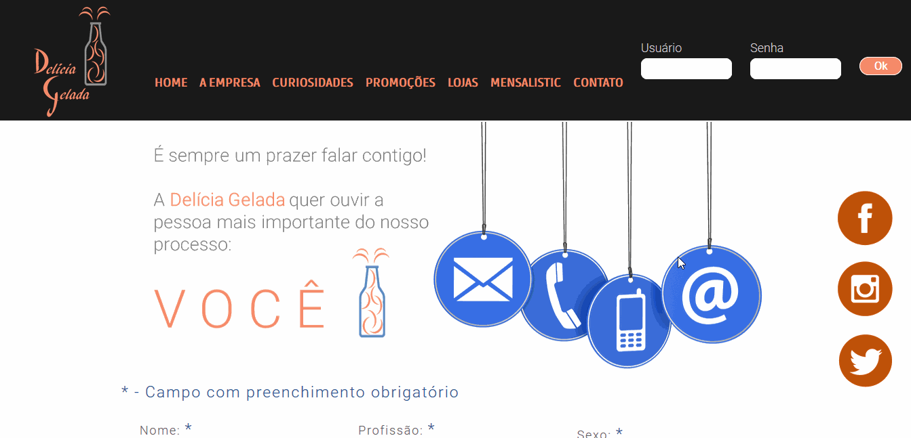
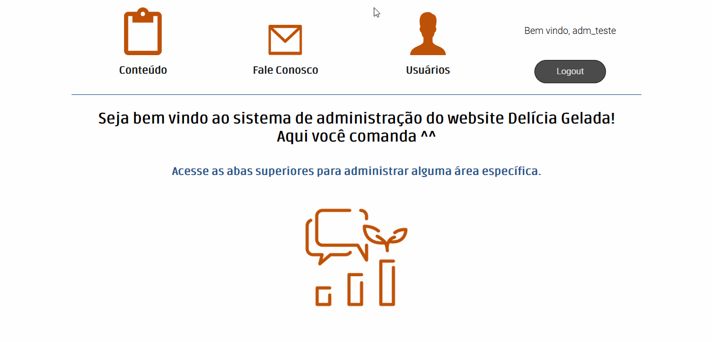
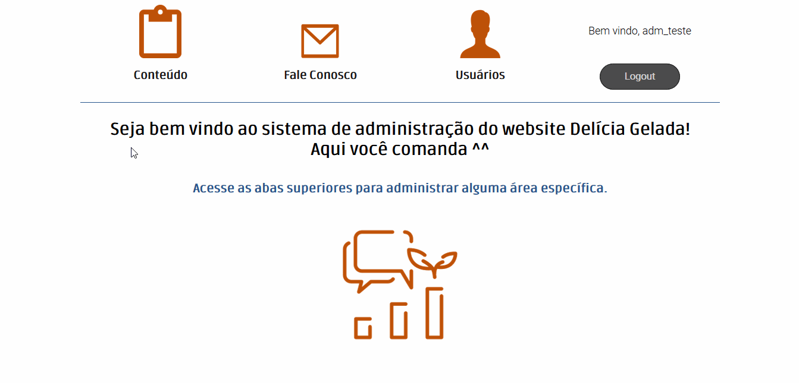

# Delicia-Gelada-Project
A PHP/MySQL CMS project of a juice web store 
---

This project was built with the challenge of developing a juice web store, including create the visual concept and find the better way to make the product attractive. 
---

## Contact Page - The costumer voice
The project must include a contact area, where the costumer should give a sugestion or a critic, about our products or anything else. 

- The fields are validated with JQuery masks;

- Data is saved and manipulated by PHP integration with MySQL database.

It's expected a great evolution of the project, including more dinamism with the pages with the CMS and even more integrating with the database, also learning more about PHP.

This project has only learning pourposes, required by the SENAI technician school, in the Systems Development technical course. None of the images used is property of the author. 

# CMS
The project include a CMS area to coordenate all the CRUD actions of the web site content, user access and contact messages. 

OBS: To authenticate on the system using the backup file, use the following data, already saved on that:
Login -> adm
User -> adm

## CMS - Usuários
The creation and control of users was fundamental to enter in the CMS area. The authentication is possible in the header or footer in the web site, but the access to CMS sectors depends on your permission profile. In backup file, we have 3 profiles already save, the "adm" user, for example, uses the "Administrador" profile, allow to free access. 

In this section, another users and profiles can be created, as the permissions you desire for each, and alter activations. Only a active user with a active profile can authenticate on system. 

## CMS - Fale Conosco
The contact page is the only from the web site where the costumer can send an advice or a critic about the products, nothing better to manage it than a page to filter the messages and build the best user experience through that content.

## CMS - Content Management
This section provides the control of all the content on the website, where it's possible to alter text content, images and titles. Any page can be choosen in the left side, and the sections where is possible to alter are costumized by their necessitys. For example, the Mensalistic page has 4 images and 3 text sections, so it's possible to alter it all in a friendly interface. 

One of the special things of this section is the page change buttons and all the actions inside of it, where it's all dynamic, the web page never brinks. It was focus to make a real good user experience.

OBS: Some of the pages content requires data to work. To elect a product of month on Mensalistic, a product creation is necessary, as to make a salle off.  

Next Steps:
- CMS management of the pages A Empresa and Lojas;
- Apply the changes made in CMS in the Curiosidades page;
- Responsiveness implementation.

Version: 1.0 - 02/10/2019

Version: 2.0 - 06/01/2020

*Everything made with a lot of curiosity and programming passion* 

